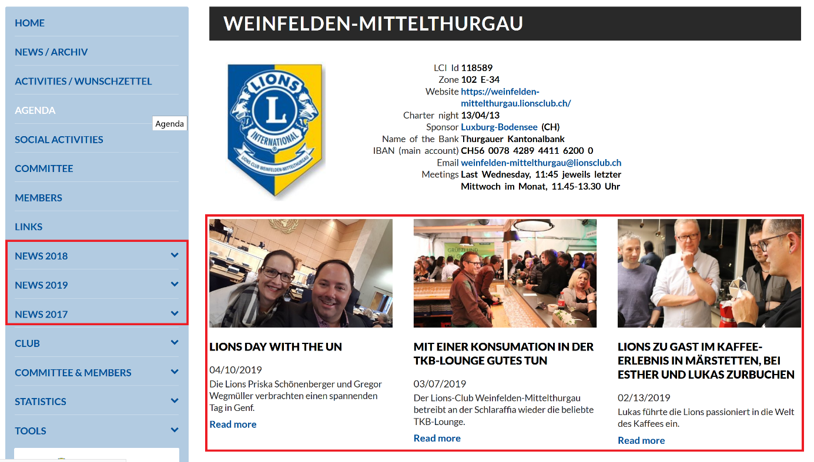

News
==================

News are short reports on the Lions Web pages (from the club to the MD)
in a space-saving and descriptive form. They appear on the club Web page
and on the home page in the News tab.

|image0|

If you click on "Read more" you will see the detailed text of the News.

|image1|

**News-image-tags on the multidistrict/district page.**

Look for the blue label in the upper left corner. You define the label
in the main index, tab Categories. (e.g. Youth, Meetings, National,
Activity, Peace poster etc.)

|image2|

**A News article consists of the following elements:**

- Title
- Teaser
- Date
- Detailed text with or without images

What is the purpose of News
---------------------------

- Inform the public and members of events through Lions Web sites.
- Share information with social networks.
- Archive past activities.

What does it take for a great News
----------------------------------

- an exceptional occasion
- a gripping text
- an eye-catching photo

Rulings
-------

- Is the News only for the club or also for the public?
- Should the News also appear on the district or multiple district Web site?
- How long should the News be available in the News section?

Creating News
-------------

Click on "News" in the directory tree or in the black LionsBase folder
on the big News icon.

|image3|

There are now two possibilities, News without (Tag 1) or with picture
gallery (Tag 2) Mostly the variant 1 is sufficient. With many images on
several levels variant 2 can be of advantage.

Select the tab "Create an empty News" A 9-part index appears, important
are "General", "Content elements" and "Media", possibly also
"Categories" and "Access".

Main index: tab "General"
-------------------------

|image4|

(Tag A) **Type:** Only "News" is used here.

(Tag B) **Top News:** Checked, this message is always at the top if
there are several content elements. All others are then sorted by date.

(Tag C) **Header:** Give your article a name (Here "Lionstag.")

(Tag D) **Teaser:** A headline-like short message can be placed here.

(Tag E) **Date & Time:** The date determines the order of the News
entries. The date is automatically the current time of creation.
However, you can change it, which then changes the order in the sorting.

(Tag F) **Archive:** You can set an end date for the News. After this
date it moves to the archive. But to let disappears theimage-tag from
the front page you have to give in the "access" an expiration date.

(Tag G) **Text:** A detailed text can be entered here. If there are
images with the text, it is better to enter this all in the "Content
elements" tab.

Main Index: Tab “Content Elements”
----------------------------------

The content elements are used for longer texts and images. Several
content elements can be inserted. Click on "Content elements" and then
on "Create new". The mask "Content Elements" opens.

|image5|

Content elements: Tab “General”
-------------------------------

Now select the type under "General". Usually it is "Text and media" or a
list of files to download (File links).

|image6|

The main index has 9 tabs. The sub index Content element 5! Even though
some of the tabs have the same name, they serve different purposes.

|image7|

|image8|

Content elements: Tab “Media”
-----------------------------

|image9|

|image10|

| With the Content element-tab "Media", you are more flexible with the
  layout.
| (Tag A) Enlarge or reduce the photos. 100-300 pixel are usual.
| (Tag B) Determine the position and the alignment of images and text.
| (Tag C) Chose the photo columns i.e. how many photos you can show next
  to each other.
| (Tag D) Enlarging the frontend-images by clicking on them

**This is how the above media and gallery settings look in the frontend
under "News":**

|image11|

Content elements: Tab “Access”
------------------------------

The News on the club's website can basically be seen by all visitors. If
you want that a content element of the News can only be seen if you are
logged in, click tab "Access” and add your own club as well to the
chosen clubs.

It is advisable to enter the publication and expiration date, as well as
the restrictions in the superior(9-part) main index tab "Access" and in
the (5-part) content element tab "Access".

If you want the News to disappear from the frontend you have to enter an
expiration date here and preferably also in the main index-tab "Access".

**Attention: the News must be public (no access restriction), otherwise
they will not be displayed in the mobile app. To set the visibility in
the mobile app only for members of your own club, select the tab
category "Internal for Club".**

|image12|

Main index: tab Media”
----------------------

See images below!

(Nr.1) The tab "Media" in the main index is used for the photo that
should appear in the tag-image in the News overview.

(Nr.2) Download it from the "File List" using "Add Media File". Of
course, you have uploaded the image from your computer to it before.

(Nr.3) Click on the grey arrow on the left side to open the image
metadata.

(Nr.4) In the “show in views” you have 3 possibilities to show this
image tag.

(Tag a) “Show only in detail views": The self-produced image-tag is only
shown in the blue News tab, but there's still a Lionshead sign on the
website.

(Tag b) Show only in list views (below Clubinfo.) The image will not
appear in the detail text. This gives a better layout if there are
photos and text from the content element Type “Text and Media”.

Show in all views. The image appears both in the News overview and in
the detailed text, which makes sense, for example, in the content
element, Type “File Links”.

Of course, you can also place several images, but it's useless, because
only the first image appears in the image-tag. If you don't specify a
tag for the News overview, you will see a neutral Lionssignet in the
frontend

(Nr.5) The "Image processing" tool is suitable for selecting a section
from a larger image.

In order to optimally display the image in the preview, the aspect ratio
should be 2.7x1.6. For example, 1200x711 pixels. With other aspect
ratios, the LB automatically cuts the image, which does not always ad to
good results.

|image13|

|image14|

(Nr.5) image manipulation opened:

|image15|

Main index: tab “Categories”
----------------------------

The "Categories" are important if the image tag is also to be uploaded
to the district's Web site. It also influences the mobile application on
smart phones. Users of the mobile app can choose from which clubs they
want to see News. If you choose the category "Internal for Clubs", this
News will only be available to your club members in the app. It will not
appear on the district's Web site.

For News of Swiss interest, select a category from “Activity” to
“Updates LionsBase”. This assignment simplifies the search on the
district website, where there are a lot of News image-tags.

|image16|

Main index: tab “Access”
------------------------

A news item on the club's website can basically be seen by all visitors.
If you want a news to be seen only when you are logged in, you can set
the tab "Access". You simply add to your own club other clubs.

It is advisable to make the "access" in the superordinate (9-part) main
index and in the sub index "Content element".

**Attention: If the News is to be visible in the mobile app, access must
not be restricted. To set the visibility in the mobile app only for
members of your own club, select the category "Internal for Club".**

|image17|

Main index: tab “Notes”
-----------------------

Notes are for information purposes only for the LionsBase
Master/Webmaster in TYPO3 internal use. They are limited to 100
characters. and appear in the headings directory in the Notes section as
on every page of the 9-part main register.

|image18|

|image19|

Make news visible on the club's Web site
----------------------------------------

News usually appears only under "News [Year]" in the blue tabs on the
club Web site. If you want News to appear on the club home page, you
must add or activate it. This is how you proceed:

(Nr.1) Select "Page" in the upper left corner and click on (Nr.2) the
club globe to display the page elements.

|image20|

The "Latest News" element is pre-installed and is located at the bottom
of the screen. If not, create a new content element of type
"Plugin->News-System". The best output mode is "List view without
overloading detail views". The remaining information does not have to be
filled in. Tap on the Un-Hide icon to make everything visible. Do not
forget to secure.

Get help!
---------

Actually, creating a News is not that difficult, but if you have any
problems, ask your district LionsBase Master. He will help.

.. |image5| image:: media/image6.png
   :width: 3.74167in
   :height: 1.6625in
.. |image6| image:: media/image7.png
   :width: 6.01667in
   :height: 3.84509in

